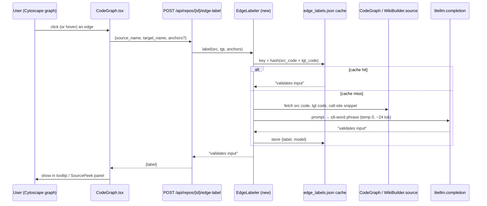

# Feature Plan — LLM Dependency Labels on Graph Edges

> **Goal:** in the interactive graph view, show a short LLM-written phrase
> describing *how/why* one symbol depends on another (e.g. "validates input",
> "loads config"), shown on hover/click, generated on-demand and cached, with
> future hooks for pre-warming and retrieval.

## Decisions (locked with product owner)

| Decision | Choice |
|----------|--------|
| Graph view | **Interactive codemap graph** (Cytoscape — `CodeGraph.tsx`); not the static Mermaid diagram |
| When generated | **On-demand + cached** (lazy on first click, then served from cache) |
| Display | **Tooltip on hover/click** — no always-on edge clutter |
| Label content | **Natural-language micro-phrase** — "how/why A uses B", ≤6 words |
| Config toggle | **Yes** — `edge_labels: bool` in `qa_config.yaml`, default **off** (opt-in) |
| Branch | new branch from **current `main`** |

## Why this is low-risk

The graph already does most of the work — we extend, not invent:

- Edges are **already clickable**: `cy.on("tap", "edge", …)` (`CodeGraph.tsx:1541-1552`)
  already opens the `SourcePeek` side panel with the exact call-site source.
- Edges already show `src → tgt · N refs` on hover in the bottom bar
  (`CodeGraph.tsx:1639-1647`).
- The graph API returns **raw dicts** (no Pydantic) — adding an edge field needs
  **zero schema changes** (`app.py` codemap/wiki_page_graph → `build_codemap`).
- Real per-edge evidence already exists: **call-site anchors** (`{file, line}`,
  the exact spot where A references B) + both symbols' code, reachable via
  `CodeGraph.get_node_content` / `WikiBuilder.source`.
- A per-repo writable cache dir already exists (`<data_dir>/wiki_cache/`) with a
  reusable read/write pattern (`AgentWiki._read_cache` / `_write_cache`).

---

## Architecture



**Edge identity:** use each endpoint's **(file, line-span)** — the frontend has
this in the codemap node data (`file`, `line`, `endLine`), but **not** the
graph's internal `name`. At edge-click the frontend reads the two connected
nodes' spans (`edge.source().data()` / `edge.target().data()`) and sends them;
the backend fetches both bodies with the repo's path-safe `source(file, start,
end)` reader. This sidesteps `name` resolution and the `project_root`-dependent
`get_node_content` entirely. (Revised from the original `name`-based scheme,
which was broken — the frontend never carries `name`.)

**Cache key:** `sha1(src_content + "␟" + tgt_content)` — keyed by the actual
symbol bytes, so a label survives renames/moves and auto-invalidates when either
symbol's code changes (mirrors the `EmbeddingsCache` content-hash idea).

---

## Config toggle (enable/disable)

The whole feature is gated by a config flag, **default off** — mirrors the
existing `rerank_strategy` / `wiki_agent` pattern in `QAConfig`.

**`codenib/web/config.py` — `QAConfig`:**
```python
edge_labels: bool = False                 # master on/off switch
edge_label_model: Optional[str] = None    # optional cheaper model; None → config.model
```
`load_config()` reads `edge_labels` / `edge_label_model` from the YAML, with an
env override `CODENIB_EDGE_LABELS=1` (same shape as `CODENIB_DEMO_MODEL`).

**`qa_config.yaml` (documented, commented default):**
```yaml
# Show short LLM-written dependency phrases on graph edges (hover/click).
# Off by default — each unseen edge costs one small LLM call (then cached).
edge_labels: false
# edge_label_model: openai/gpt-4o-mini   # optional cheaper model for these short calls
```

**Enforcement — three layers:**
1. **Backend endpoint** returns `{label: "", disabled: true}` (or 404) when
   `config.edge_labels` is false — never calls the LLM.
2. **Capability flag to the frontend:** add `edge_labels: bool` to `RepoInfo`
   (`schemas.py`, already returned by `GET /api/repos`) so the UI knows whether
   the feature is live.
3. **Frontend** only wires the edge-tap fetch when `repo.edge_labels` is true;
   otherwise the graph behaves exactly as today (ref-count only).

Flipping `edge_labels: true` + restarting the backend turns it on with no code
change — same ergonomics as the `rerank_strategy` toggle.

---

## Backend

### New module: `codenib/web/edge_label.py`

```python
class EdgeLabeler:
    def __init__(self, bundle, model: str, cache_dir: str): ...
    def label(self, source_name: str, target_name: str,
              anchors: list[dict] | None = None) -> str:
        # 1. resolve both symbols' code:
        #    vid = graph.name_to_vertex[name]; code = graph.get_node_content(vid)
        #    (fallback: WikiBuilder.source(file, start, end) from node file/line)
        # 2. cache key = _hash(src_code + tgt_code); check edge_labels.json
        # 3. on miss: build prompt (below), litellm.completion(max_tokens≈24,
        #    temperature=0, **_no_thinking_kwargs(model)), take first line, ≤6 words
        # 4. store {label, model}; return
        # 5. any failure → "" (frontend falls back to "N refs")
```

- **Cache:** one `edge_labels.json` per repo in `<data_dir>/wiki_cache/`, format
  `{ "<src_hash>:<tgt_hash>": {"label": "...", "model": "..."} }`. Reuse the exact
  `_read_cache`/`_write_cache` shape from `agent_wiki.py:110-128`. Per-repo scoping
  via `instance_id@commit` in the filename (like `AgentWiki._key`).
- **Model:** `config.model` threaded in exactly like `AgentWiki` (`app.py:93`).
  Optional cheaper override env `CODENIB_EDGE_MODEL` (short calls — a mini model
  is plenty).
- **LLM call:** mirror `narrator.py:127-137` (direct `litellm.completion`, one
  message, small `max_tokens`, `temperature=0`, `_no_thinking_kwargs`, try/except).

### The prompt (draft)

```
You are labeling a dependency edge in a code graph.

SOURCE symbol `{src_name}` ({src_file}):
```{lang}
{src_code}
```

It references TARGET symbol `{tgt_name}` ({tgt_file}) at these call sites:
{anchor_snippets}   # a few lines around each anchor_line

In AT MOST 6 words, describe HOW or WHY the source uses the target
(e.g. "validates user input", "loads DB config", "dispatches to handler").
Reply with ONLY the phrase — no punctuation, no quotes, no explanation.
```

### New endpoint: `app.py`

```python
@app.post("/api/repos/{repo_id}/edge-label")
async def edge_label(repo_id: str, req: EdgeLabelRequest):
    labeler = _edge_labeler(repo_id)          # cached per repo, like _wiki()
    label = await asyncio.to_thread(
        labeler.label, req.source, req.target, req.anchors)
    return {"label": label}
```

- `EdgeLabelRequest` (a small Pydantic model in `schemas.py`): `{source: str,
  target: str, anchors: list[CallSite] | None}`.
- Optional **batch** variant `POST /edge-labels` (list in, list out) for future
  pre-warm — not needed for v1.

---

## Frontend

### `web/lib/api.ts`

- Add `label?: string` to `CodemapEdge`.
- Add `fetchEdgeLabel(repoId, source, target, anchors?) → Promise<{label: string}>`
  (POST to the new endpoint).

### `web/components/CodeGraph.tsx`

- **Trigger:** primarily on **edge click** (`cy.on("tap", "edge", …)`,
  `:1541-1552`) — it already fires and opens `SourcePeek`. Lazily call
  `fetchEdgeLabel` if the label isn't already known; keep a client-side
  `Map<edgeKey, string>` so repeat clicks/hovers don't refetch.
- **Display:** show the phrase in the existing `SourcePeek` edge panel
  (`GraphView.tsx:40-187`) as a one-line header ("*validates user input*"), and/or
  in the hover bottom bar (`:1639-1647`) next to `N refs`. Loading → "…", failure
  → fall back to the current `N refs` text.
- **Hover option (optional, debounced):** if we also want hover, debounce ~400ms
  so mousing across the graph doesn't fire a burst of LLM calls. **Recommendation:
  click-first for v1** (avoids hover-spam; matches "clickable edge"); add debounced
  hover later.
- Keep edges visually clean (no always-on Cytoscape edge label) per the display
  decision. (If we ever want always-on, `label: "data(edgeLabel)"` on the edge
  style block `:1338-1350` is the hook — out of scope for v1.)

---

## Build order (milestones)

1. **Backend skeleton, no LLM** — `EdgeLabeler` + cache + endpoint returning a
   stub (e.g. `"references"`). Wire the frontend click → fetch → SourcePeek header
   end-to-end. Proves the plumbing.
2. **Real LLM labeling** — the prompt + `litellm.completion`, code/anchor fetch,
   ≤6-word parsing, graceful failure.
3. **Cache** — `edge_labels.json` read/write, content-hash keys, model stored for
   invalidation. Verify a second click is a cache hit (no LLM call).
4. **Polish** — loading/empty/error states, client-side session cache, optional
   debounced hover.
5. **Future (not v1):** batch pre-warm of top-N edges (by `weight`/PageRank) at
   wiki build; label editing/override; retrieval-augmented labels.

## Tests

- **Unit (`test/web/test_edge_label.py`):** cache hit/miss; key stability across
  calls; key changes when symbol code changes; graceful `""` on LLM error; ≤6-word
  truncation. Mock `litellm.completion`.
- **API:** `POST /edge-label` returns a label; second call served from cache (LLM
  mock called once).
- **Frontend:** clicking an edge fetches once and renders the phrase in SourcePeek;
  repeat click uses the cached value.

## Files touched

| File | Change |
|------|--------|
| `codenib/web/edge_label.py` | **new** — `EdgeLabeler` + cache |
| `codenib/web/config.py` | `edge_labels` / `edge_label_model` in `QAConfig` + `load_config` + env override |
| `qa_config.yaml` | documented `edge_labels: false` default |
| `codenib/web/app.py` | new `POST /api/repos/{id}/edge-label` (gated) + `_edge_labeler()` helper |
| `codenib/web/schemas.py` | `EdgeLabelRequest` model; `edge_labels: bool` on `RepoInfo` |
| `web/lib/api.ts` | `label?` on `CodemapEdge`; `fetchEdgeLabel()` |
| `web/components/CodeGraph.tsx` | lazy fetch on edge tap; show in SourcePeek/bar |
| `web/components/GraphView.tsx` | render label in `SourcePeek` edge panel |
| `test/web/test_edge_label.py` | **new** — unit + cache tests |

## Cost / latency

On-demand + cache keeps it cheap: one short LLM call (~24 tokens) only on the
**first** click of an edge, then free forever from cache. Click-first (not
hover-fire) avoids bursts. A dense graph never triggers mass generation.

## Key references (verified)

- Cytoscape edges + handlers: `web/components/CodeGraph.tsx:420-479`, `:1519-1552`, `:1639-1647`
- Edge dict construction: `codenib/web/codemap.py:398`, `:665`; enrich `:251`
- Endpoints: `codenib/web/app.py:131` (wiki graph), `:166` (codemap)
- Symbol code: `CodeGraph.get_node_content` `code_graph.py:915`; `WikiBuilder.source` `builder.py:523`
- Edge anchors/metadata: `traverse_graph.py:88-97`; edge attrs `code_graph.py:404-407`
- LLM call pattern: `narrator.py:127-137`; `LiteLLMChat` `litellm_chat.py:213-324`
- Cache pattern: `agent_wiki.py:110-128`; content-hash idea `embeddings_cache.py`
- Model resolution: `config.py:51/108/132`; threaded at `app.py:93`
