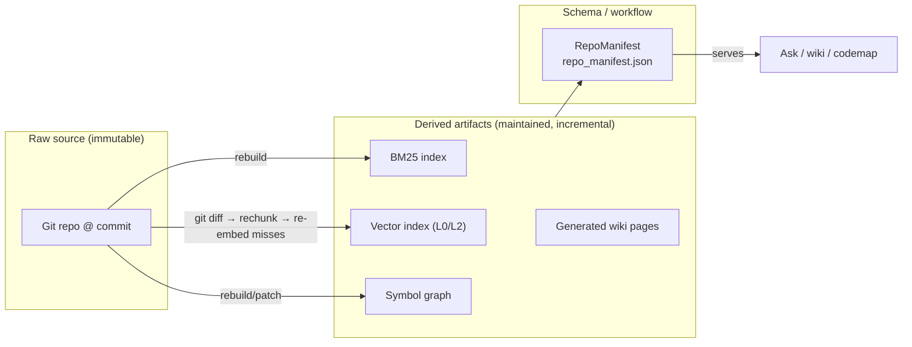
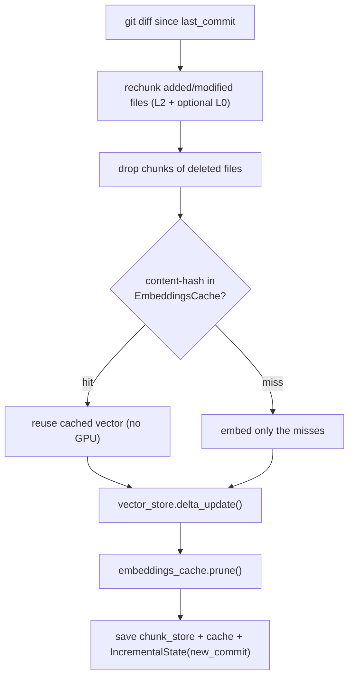
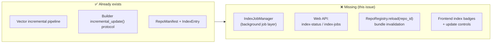
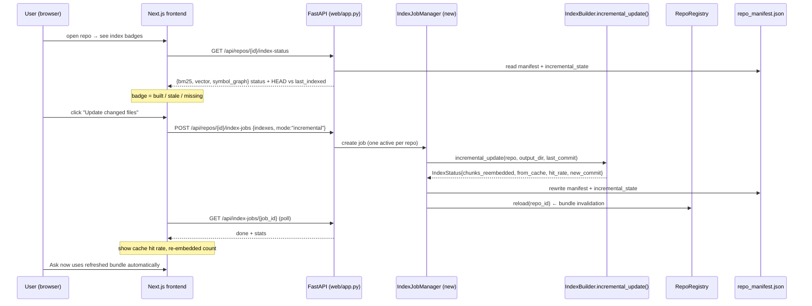

# Incremental Indexing in the Web UI — Architecture & Plan

> Notes for CodeMiner issue #266 — *feat(web): expose incremental indexing controls and status*
> Grounded in the actual backend code (verified file:line refs below).
> Framing borrowed from Karpathy's "LLM Wiki" gist.

---

## 1. The mental model (Karpathy's LLM Wiki, applied to CodeMiner)

Karpathy's gist argues for a shift away from *re-derive-from-scratch RAG* toward a
**persistent, incrementally-maintained derived artifact**. Three layers:

| Karpathy's LLM Wiki | CodeMiner equivalent |
|---------------------|----------------------|
| **Raw sources** (immutable — articles, papers) | **The git repo** — source files at a commit. Read, never mutated. |
| **The wiki** (LLM-owned derived artifact, compounds over time) | **The indexes** (BM25 + vector + symbol graph) **and generated wiki pages** — derived artifacts that should be *refreshed*, not rebuilt. |
| **The schema** (CLAUDE.md — structure, workflow, lint) | **`RepoManifest`** (`repo_manifest.json`) + the compile/serve workflow. |

Karpathy's key insight: *"the bookkeeping burden grows faster than the value"* — humans
give up maintaining wikis by hand. The machine doesn't. CodeMiner already has the
machinery to keep the derived artifacts fresh from a git diff — **issue #266 is about
making that machinery visible and controllable from the web UI** instead of re-deriving
knowledge on every question.

---

## 2. What already exists (the good news)

The backend has **most of the machinery**. The gap is almost entirely at the web seam.

### 2a. The one TRUE incremental path — vector index

`VectorIndexBuilder.incremental_update()` (`codeminer/compiler/index_builders.py:243-392`)
runs a real delta pipeline via `IncrementalIndexUpdater.update()`
(`codeminer/index/incremental/index_updater.py:101-252`):

**Supporting classes** (`codeminer/index/incremental/`):

| Class | File | Persists / does |
|-------|------|-----------------|
| `GitDiffDetector` | `git_diff.py:74` | `git diff --name-status` → `RepoChanges{added, modified, deleted, old_commit, new_commit}`; SHA-injection guarded |
| `IncrementalChunkStore` | `chunk_store.py:58` | `content_hash`-keyed `VersionedChunk`s per file/level; `update_file()` returns (added, removed) by hash diff |
| `EmbeddingsCache` | `embeddings_cache.py:28` | content-hash → float32 vector; `prune(active_hashes)` evicts stale; saved as `.json`+`.npz` |
| `IncrementalIndexUpdater` | `index_updater.py:72` | orchestrates the 6-step pipeline above → `UpdateResult` |
| `IncrementalState` | `state.py:29` | `last_commit`, chunk-store path, cache path, build levels → `incremental_state.json` |

**Metadata the vector incremental path already returns** (`IndexStatus.metadata`, `index_builders.py:383-391`) — exactly the stats the issue wants surfaced:
`chunks_reembedded`, `chunks_from_cache`, `cache_hit_rate`, `new_commit`, `document_count{l0,l2}`, `embedding_model`, `levels`.

### 2b. The rebuild-fallback indexes

`incremental_update()` is defined on all builders but only vector is real:

| Builder | `incremental_update()` | Mode to show in UI |
|---------|------------------------|--------------------|
| `VectorIndexBuilder` | true delta (`:243-392`) | **incremental** |
| `BM25IndexBuilder` | `return self.build(...)` (`:102`) | **rebuild** |
| `ZoektIndexBuilder` | `return self.build(...)` (`:463`) | **rebuild** |
| `SymbolGraphBuilder` | `return self.build(...)` (`:511`) | **rebuild** (true graph patching exists under `codeminer/graph/incremental/` but is **not wired** into this builder) |

### 2c. The manifest (schema layer)

`IndexCompiler.compile_repo()` (`codeminer/compiler/index_compiler.py:78-148`) writes
`<repo>/.codeminer_cache/repo_manifest.json` (`RepoManifest`, `manifest.py:66`). Per-index
state lives in `IndexEntry` (`manifest.py:30`): `index_type`, `path`, `built_at`, `status`
(`fresh`/`failed`), `config`, `metadata`. The incremental baseline `last_indexed_commit`
lives on the manifest; the vector delta baseline `new_commit` lives separately in
`incremental_state.json`.

> ⚠️ **Gap #1:** `compile_repo()` always calls `builder.build()`, **never `incremental_update()`** (`index_compiler.py:150-180`). There is no code path today that triggers an incremental update outside of tests.

---

## 3. The gaps issue #266 must bridge

| # | Gap | Where | Fix |
|---|-----|-------|-----|
| 1 | Nothing calls `incremental_update()` outside tests | `index_compiler.py:150` | Job layer that invokes builder incremental path |
| 2 | Web API is **read-only** — no reindex endpoint | `web/app.py` (all 8 endpoints are GET except read-only `POST /api/chat`) | Add `index-status` + `index-jobs` endpoints |
| 3 | **No reload after an index changes** — `load_all()` runs once at startup; loaded `vector_store`/`bm25`/`code_graph` cached for server lifetime | `web/repo_registry.py:264` (`RepoRegistry`, no `reload()`) | Add `RepoRegistry.reload(repo_id)` / bundle invalidation |
| 4 | Frontend has an **inert "Add repo" tile** and no index status | `web/app/page.tsx:132-140` | Index badges on repo cards + `Indexes` control |

---

## 4. Proposed architecture (target state)

### Backend components to add (under `codeminer/web/`)

- **`IndexJobManager`** — wraps `IndexBuilderRegistry` + `IndexCompiler` + builder
  `incremental_update()`. One active job per repo (no concurrent writes to a cache dir).
  Rejects `incremental` for rebuild-only indexes *or* runs the documented rebuild with
  `update_mode: "rebuild"` in the result. Copy-on-write out of read-only `prebuilt_dir`
  into `data_dir` before writing.
- **`RepoRegistry.reload(repo_id)`** — re-read the manifest, drop the cached
  `RepoBundle` runtime so Ask/wiki/codemap pick up new artifacts **without a server restart**.

### API surface (from the issue)

| Method + Path | Purpose |
|---------------|---------|
| `GET /api/repos/{id}/index-status` | per-index state, `last_indexed_commit` vs HEAD, stale flag, capability, update mode |
| `POST /api/repos/{id}/index-jobs` | `{indexes:[...], mode:"incremental"\|"full", force?}` → `job_id` |
| `GET /api/index-jobs/{job_id}` | status, stage, per-index result metadata, timestamps |
| `GET /api/index-jobs/{job_id}/events` *(later)* | SSE live progress — polling is fine for v1 |

### Frontend surface

- **Repo card** (`page.tsx`): three index badges — `built / missing / stale / updating / failed` — plus last-indexed commit vs HEAD.
- **`Indexes` control** on the repo header: three rows (BM25, Embeddings, Symbol graph) with `Update changed files` (when a prior commit exists) and `Rebuild selected`.
- **Ask page** (`[repoId]/ask/page.tsx`): show staleness before asking; `Update indexes first` vs `Ask with current index`; auto-use reloaded bundle after a job finishes.

---

## 5. Three index surfaces — the honest capability matrix

The UI must **not** describe a rebuild as "incremental". This is an explicit acceptance criterion.

| Surface | Index type | Incremental support today | UI update mode | Stats to show |
|---------|-----------|---------------------------|----------------|---------------|
| **Keyword** | `bm25` | rebuild only | `rebuild on update` | indexed commit |
| **Semantic** | `vector` | ✅ true delta | `incremental` | `chunks_reembedded`, `chunks_from_cache`, `cache_hit_rate`, `new_commit` |
| **Symbol graph** | `symbol_graph` | rebuild (patching exists but unwired) | `patch` / `rebuild` / `unavailable` | capability + mode |

---

## 6. Suggested milestones

1. **Read-only status first** — `GET /api/repos/{id}/index-status` + repo-card badges.
   Pure derive-from-manifest, no job layer. Ships value immediately (users see staleness).
2. **Vector incremental job** — `IndexJobManager` + `POST index-jobs` wired to the *one*
   true incremental path; surface the cache-hit stats. Highest value, lowest risk.
3. **Registry reload** — `RepoRegistry.reload(repo_id)` so Ask/wiki reflect the update
   with no restart.
4. **BM25 / symbol-graph rebuild** — same job layer, honest `rebuild` mode.
5. **Later** — SSE progress; wire symbol-graph patching; Karpathy-style "file answer back
   to wiki" (persist Ask discoveries as wiki pages).

---

## 7. Open questions (from the issue, with a lean)

- **Raw index types vs presets?** → raw types (`bm25`/`vector`/`symbol_graph`) with
  human-readable names; they map 1:1 to `IndexEntry` in the manifest.
- **Symbol graph v1: rebuild-only or wire `graph_patch()`?** → rebuild fallback first
  (safe), wire patching as a follow-up.
- **Wiki regeneration in the same job or separate?** → separate derived artifact; refresh
  after indexes update.
- **`Add repo`: local path vs git URL?** → local path for dev first; clone-from-URL later.

---

## Key file reference (verified)

| Concern | File:line |
|---------|-----------|
| Builder protocol + registry | `codeminer/compiler/index_builders.py:32`, `:40` |
| Vector true incremental | `codeminer/compiler/index_builders.py:243-392` |
| Rebuild fallbacks | bm25 `:102`, zoekt `:463`, symbol_graph `:511` |
| Incremental pipeline | `codeminer/index/incremental/index_updater.py:101-252` |
| UpdateResult stats | `codeminer/index/incremental/index_updater.py:52-69` |
| Manifest / IndexEntry | `codeminer/compiler/manifest.py:66`, `:30` |
| Compile (build-only!) | `codeminer/compiler/index_compiler.py:78-148`, `:150-180` |
| Web endpoints (read-only) | `codeminer/web/app.py` (8 routes) |
| No-reload gap | `codeminer/web/repo_registry.py:264` (`RepoRegistry`) |
| Frontend hooks | `web/app/page.tsx:132` (Add-repo tile), `web/app/[repoId]/ask/page.tsx` |
