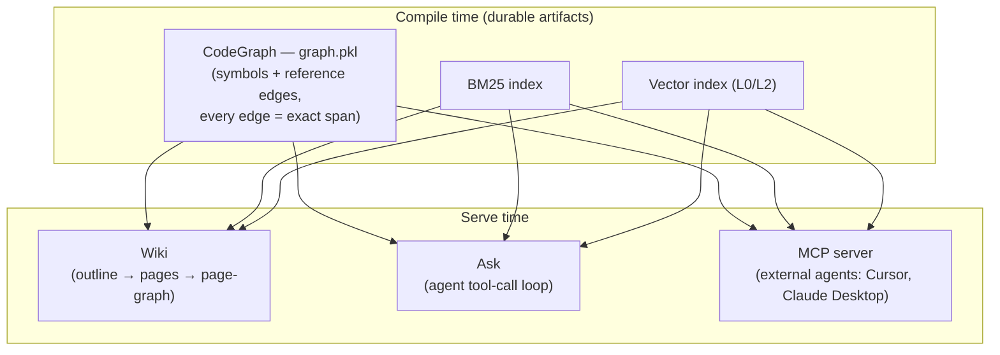
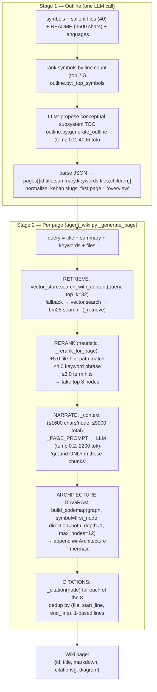
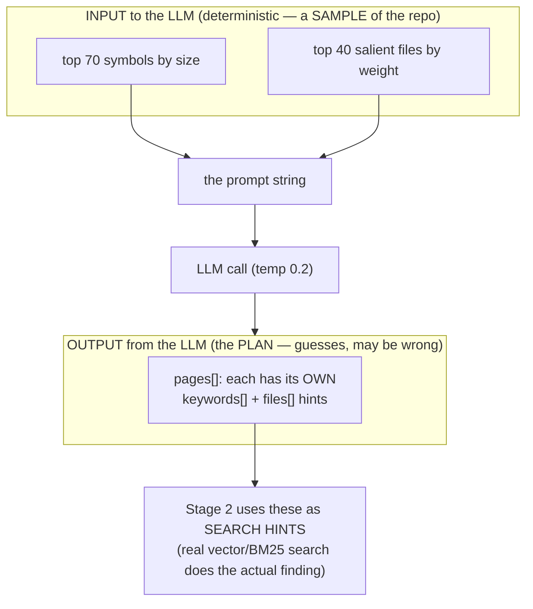
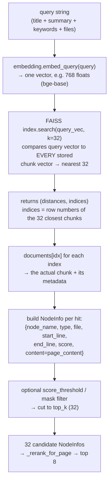
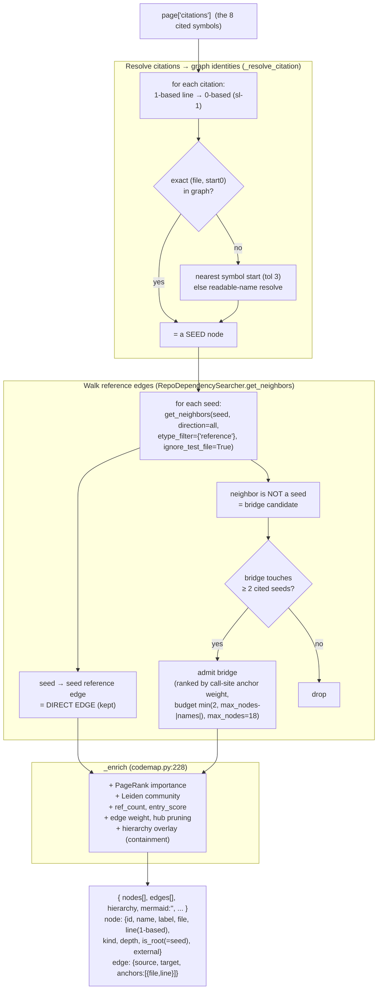
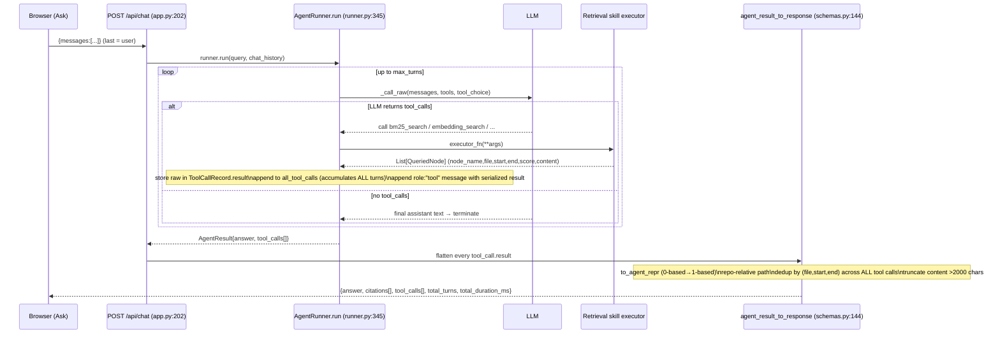
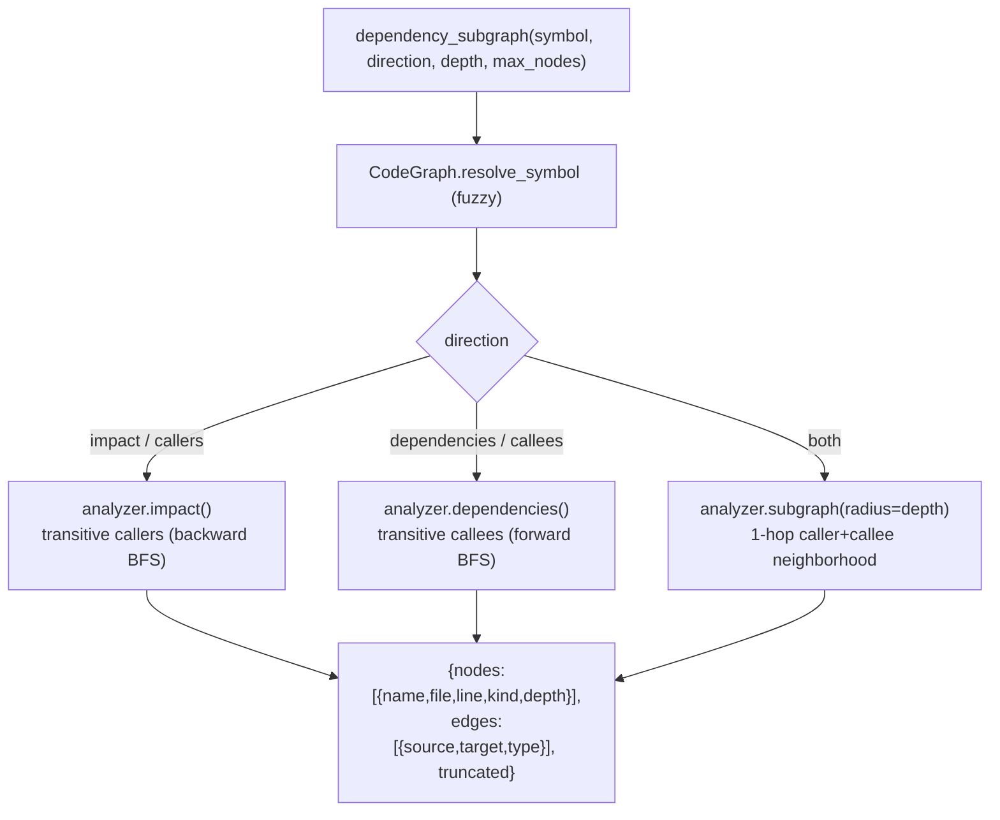
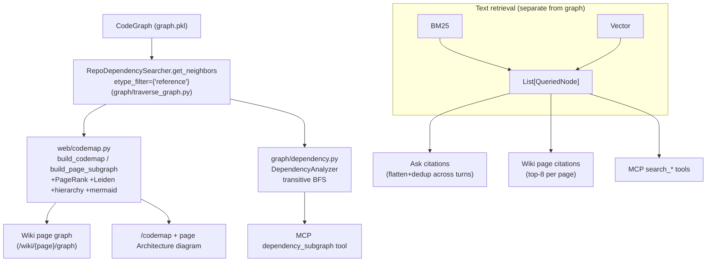

# Wiki Graph & Agent References — How CodeMiner Retrieves and Renders

> Personal notes — how the **wiki builds its dependency graph**, and how
> **references/citations are retrieved** for agents in **Ask** and over **MCP**.
> Grounded in the actual code (file:line verified). Figures are Mermaid — they
> render as images on GitHub and in VS Code with the *Markdown Preview Mermaid
> Support* extension (`bierner.markdown-mermaid`).

---

## 0. The big picture — one graph, three consumers

Everything hangs off **one compiler-precise artifact**: the `CodeGraph`
(`graph.pkl`), built at compile time, where every edge resolves to an exact
source span. Three surfaces consume it, plus retrieval indexes (BM25 + vector)
feed the text side.



**Key fact for later:** the graph is queried through **two different subgraph
builders** that share **one traversal primitive**
(`RepoDependencySearcher.get_neighbors(..., etype_filter={"reference"})` in
`graph/traverse_graph.py`):

| Builder | File | Used by | Extras |
|---------|------|---------|--------|
| `build_codemap` / `build_page_subgraph` | `web/codemap.py` | Wiki page graph + `/codemap` | PageRank importance, Leiden communities, hierarchy overlay, mermaid |
| `DependencyAnalyzer` | `graph/dependency.py` | MCP `dependency_subgraph` tool | transitive BFS (impact/dependencies/both) |

Neither uses `graph/roi_subgraph.py`.

---

## 1. How the wiki is generated (and where its citations come from)

Two disk-cached stages in `codeminer/wiki/agent_wiki.py` (+ `outline.py`).
`AgentWiki` is built per-repo in `web/app.py:_wiki` when `config.wiki_agent` is on.



**The page object** (`_generate_page` return, `agent_wiki.py:460`):

```jsonc
{
  "id": "graph-retrieval",
  "title": "Graph Retrieval",
  "markdown": "# Graph Retrieval\n\n{narration}\n\n## Architecture\n```mermaid ...```",
  "citations": [
    { "file": "codeminer/graph/code_graph.py",
      "start_line": 120, "end_line": 180,   // 1-based (graph is 0-based → +1)
      "node_name": "CodeGraph", "type": "class",
      "score": 7.5, "content": null }
  ],
  "diagram": ""
}
```

> The 8 citations are the **only** grounding the LLM sees. Retrieval quality
> here = documentation quality. (Today's rerank is pure string heuristic — a
> cross-encoder would be a future upgrade.)

### 1.1 Two kinds of "files" — how the ranks and the parsed outline are used

A common point of confusion: there are **two completely different sets of
"files"** in Stage 1, flowing in opposite directions. Don't conflate them.



- **The ranked 40 files / 70 symbols = INPUT context.** They are a
  *representative sample* of the repo, formatted into the prompt so the model has
  something to reason over (you can't put 10,000 symbols in a prompt). Their
  **only** job is to shape what the LLM sees — they are never page content, and
  after the prompt is built the ranks are never looked at again.
- **The per-page `files` the LLM returns = OUTPUT guesses.** A different list
  entirely — the model's opinion of which files belong to each concept. These
  **can be inaccurate.**

**How the ranks are used:** only to build the prompt (the model's "briefing
material"). That's the whole role.

**How the parsed JSON is used:** it *is the plan* — the table of contents plus
per-page `keywords`+`files` search hints. It gets cached, then handed to
**Stage 2**, which builds a query (`title + summary + keywords + files`) and runs
**real vector + BM25 retrieval over the whole index**.

**Why the LLM's possibly-wrong file guesses don't break anything:** Stage 2 does
**not** trust them blindly. The hints only *build the query* and *boost* matching
results (the `+5.0` file-hint in `_rerank_for_page`); the actual code is found by
real search over the full index, which can locate the right chunks even if the
LLM guessed the wrong filename.

| Step | Trust level | What it does |
|------|-------------|--------------|
| Rank 70 symbols / 40 files | deterministic fact | sample the repo → prompt context |
| LLM proposes pages + `files`/`keywords` | **guess** (may be wrong) | conceptual TOC + search hints |
| Stage 2 retrieval | deterministic fact | real search finds the actual code; hints only nudge ranking |

The LLM is trusted to decide **what concepts exist** and **roughly what to search
for** — never **which exact code goes on the page**. That final decision is made
by real retrieval against the index.

### 1.2 Inside the search — how `search_with_content` actually finds chunks

`_retrieve` fetches a **pool of 32** (`pool_k = max(8, 8*4)`) so the reranker has
room to pick the best 8. Here is what one `search_with_content(query, top_k=32)`
call actually does (`vector_store.py:669` → `_search_index`):



**The whole thing is 3 real operations:**

1. **Embed the query** — `embedding.embed_query(query)` turns the text into one
   vector (a list of ~768 floats). The chunk vectors were already embedded at
   compile time; now the *query* gets embedded into the same space.
2. **Nearest-neighbour lookup** — `index.search(query_vec, k=32)` asks FAISS
   "which 32 stored chunk-vectors are closest to this query-vector?" FAISS returns
   their distances (scores) and their row indices. This is the "search": pure
   vector proximity, no keywords.
3. **Map indices back to chunks** — index `idx` → `documents[idx]` gives the real
   chunk with its metadata (`name, file, start_line, end_line`) and its code text
   (`page_content`).

**`search` vs `search_with_content`** are *identical* except the latter attaches
`content=doc.page_content` (the actual code) to each result — which the wiki
needs, because the page prose is written from that code. `search` omits it (used
where only locations/scores matter).

`level="l2"` searches the function/method index (the default); `l0` would search
file-skeleton vectors. `score_threshold` and `mask_node_ids` are optional filters
(unused by the wiki path).

---

## 2. How the wiki builds its dependency graph

This is the `GET /api/repos/{id}/wiki/{page_id}/graph` endpoint
(`app.py:wiki_page_graph:131`). It does **not** re-search — it takes the page's
**already-computed citations** and induces a subgraph over them from the
`CodeGraph` via `web/codemap.py:build_page_subgraph`.



**Why "≥2 seeds" for bridges?** A page's citations are scattered symbols. A
non-cited symbol is only worth adding to the picture if it *connects* at least
two of them — otherwise the graph fills with noise. This keeps the page graph
tight and about *the page's* concepts.

The general `GET /codemap?symbol=X` endpoint (`app.py:166` → `build_codemap`,
`codemap.py:277`) is the same machinery but seeded from **one** symbol with a
BFS radius (depth 1–4, direction → forward/backward/all) instead of a citation
set. `build_codemap` is also what generates the per-page **Architecture** mermaid
diagram in Stage 2 above.

---

## 3. Ask flow — how references reach the agent's answer

`POST /api/chat` (`app.py:chat:202`) → `AgentRunner.run` → tool-call loop →
retrieval skills return `List[QueriedNode]` → those become the answer's citations.



**Response shape** (`schemas.py:ChatResponse:80`):

```jsonc
{
  "answer": "…prose…",
  "citations": [
    { "file": "codeminer/index/sparse_idx/bm25_index.py",
      "start_line": 40, "end_line": 88,          // 1-based at API boundary
      "node_name": "BM25CodeIndexer", "type": "class",
      "score": 12.3, "content": "…≤2000 chars…" }
  ],
  "tool_calls": [
    { "skill_id": "bm25_search", "arguments": {...},
      "result_count": 25, "duration_ms": 41, "error": null }
  ],
  "total_turns": 3,
  "total_duration_ms": 4210
}
```

**The chain in one line:** skill returns `List[QueriedNode]` →
`ToolCallRecord.result` (raw) → `all_tool_calls` accumulates across every turn →
`agent_result_to_response` flattens + dedups → `Citation[]` shown as the
`file:line` boxes in the UI.

**Skills registered as tools** (from `agent/skills/`, demo sets
`include_default_tools=False` so no read/grep/glob/bash):
`bm25_search`, `embedding_search`, `hybrid_search` (→ `List[QueriedNode]`),
`find_callers`, `find_callees`, `trace` (call-graph nav),
`codeminer_context`, `code_to_query`, `crossencoder_rerank`, `llm_rerank`.

> Demo forces `first_turn_tool_choice="required"` (`repo_registry.py:379`) so the
> agent must retrieve before answering — this is why answers are grounded and
> cited rather than hallucinated.

---

## 4. MCP flow — references for external agents

`codeminer-mcp <manifest.json>` (`mcp/server.py:main:328`) runs a `FastMCP`
stdio server. It loads the **same index classes** as the web path, just onto a
`ServerContext` instead of a `RepoBundle`.

```mermaid
flowchart LR
    M["repo_manifest.json"] --> L

    subgraph L["ServerContext.load (mcp/context.py:47)"]
        L1["_load_symbol_graph → CodeGraph.load_graph"]
        L2["_load_bm25 → BM25CodeIndexer.load_index"]
        L3["_load_regex_index → RegexNodeIndex(symbol_graph)"]
        L4["_load_zoekt → ZoektSearcher.start (soft dep)"]
        L5["_load_vector → CodeVectorStore.load"]
    end

    L --> T

    subgraph T["Registered @mcp.tool tools (server.py)"]
        T1["search_semantic → ctx.vector.search_with_content"]
        T2["search_bm25 → ctx.bm25.search"]
        T3["search_regex → ctx.regex_index.search"]
        T4["search_zoekt → ctx.zoekt.search (file-level)"]
        T5["dependency_subgraph → DependencyAnalyzer(graph)"]
        T6["get_manifest → manifest.to_dict()"]
    end

    T --> EXT["External agent\n(Cursor / Claude Desktop)\ndecides its own reranking"]
```



**Tool return shapes** — the 5 index-backed tools serialize via
`node.model_dump(exclude_none=True)` — the **same `NodeInfo` type** the agent
skills use, so an external agent gets identical `{node_name, type, file,
start_line, end_line, content, score}` records.

| MCP tool | Impl | Returns |
|----------|------|---------|
| `search_semantic` | `tools/search.py:27` | `list[NodeInfo]` (vector dot-product) |
| `search_bm25` | `search.py:81` | `list[NodeInfo]` (lexical) |
| `search_regex` | `search.py:120` | `list[NodeInfo]` (symbol-level pattern) |
| `search_zoekt` | `search.py:174` | `list[dict]` **file-level** (`type="file"` + snippet) |
| `dependency_subgraph` | `tools/dependency.py:20` | `{root, direction, nodes[], edges[], truncated, note}` |
| `get_manifest` | `server.py:204` | repo metadata |

**Dependency subgraph over MCP** uses `graph/dependency.py:DependencyAnalyzer`
(a *different* builder from the web codemap, but the same reference-edge
primitive):



Reference edges only (`_REFERENCE_EDGES={"reference"}`); containment excluded.
No separate "codemap" tool over MCP — `dependency_subgraph` **is** the MCP
equivalent of the web `/codemap` + wiki page-graph endpoints.

---

## 5. Side-by-side — the three reference paths



| Surface | Text references from | Graph from | Builder |
|---------|---------------------|------------|---------|
| **Wiki page** | vector→bm25 top-8 (heuristic rerank) | page citations → induced subgraph | `build_page_subgraph` |
| **Wiki page graph** | (reuses citations) | reference edges + ≥2-seed bridges | `build_page_subgraph` |
| **Ask** | agent-chosen skills, all turns | (via `find_callers`/`trace` skills) | skill-side |
| **MCP** | `search_*` tools, caller-chosen | `dependency_subgraph` | `DependencyAnalyzer` |

---

## Key file reference (verified)

| Concern | File:line |
|---------|-----------|
| Wiki outline (Stage 1) | `codeminer/wiki/outline.py:generate_outline:96` |
| Wiki per-page gen (Stage 2) | `codeminer/wiki/agent_wiki.py:_generate_page:445` |
| Wiki retrieve (32→8) | `agent_wiki.py:_retrieve:203`, `_rerank_for_page:289` |
| Wiki citations | `agent_wiki.py:_citation:380` |
| Wiki page graph endpoint | `codeminer/web/app.py:wiki_page_graph:131` |
| Page subgraph builder | `codeminer/web/codemap.py:build_page_subgraph:476` |
| Codemap / architecture diagram | `codeminer/web/codemap.py:build_codemap:277` |
| Shared traversal primitive | `codeminer/graph/traverse_graph.py:RepoDependencySearcher.get_neighbors` |
| Graph load | `codeminer/web/repo_registry.py:code_graph:170` |
| Ask endpoint | `codeminer/web/app.py:chat:202` |
| Agent loop | `codeminer/agent/runner.py:run:345`, `_execute_tool_call:637` |
| Ask citation assembly | `codeminer/web/schemas.py:agent_result_to_response:144` |
| MCP entry | `codeminer/mcp/server.py:main:328` |
| MCP context load | `codeminer/mcp/context.py:ServerContext.load:47` |
| MCP dependency tool | `codeminer/mcp/tools/dependency.py:dependency_subgraph_impl:20` |
| MCP dependency analyzer | `codeminer/graph/dependency.py:DependencyAnalyzer` |

---

## See also

- [[rerank-architecture]] — how the retrieval candidates feeding these citations are ranked (BM25/vector/cross-encoder/LLM).
- [[incremental-indexing-plan]] — how the CodeGraph + indexes stay fresh from a git diff.
