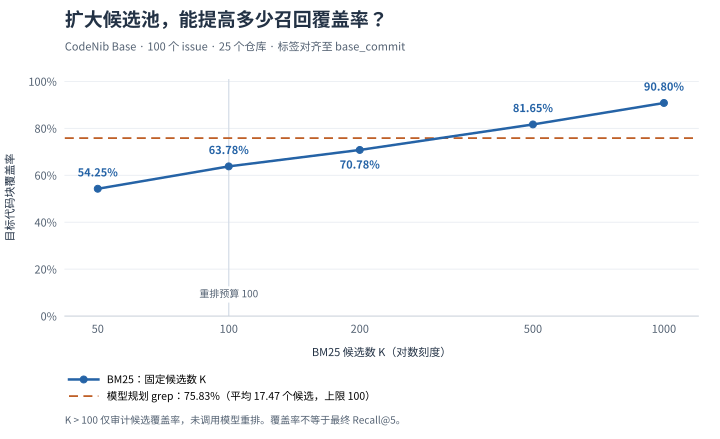

<!--
SPDX-FileCopyrightText: 2025-2026 CodeNib Contributors

SPDX-License-Identifier: Apache-2.0
-->

# 让大模型写 grep，再让 Jev 排序：一次代码检索实验

2026-09-23 · CodeNib

给 CodeNib 接入 Jev 时，我们最初想回答一个很实际的问题：如果模型能直接判断代码是否相关，能不能省掉 embedding，顺便减少检索延迟？接着，问题变得更具体了：BM25 能不能直接接 Jev？候选窗口应该开到 100 还是 1000？如果让大模型先想好 grep 的动作，再把找到的代码交给 reranker，会发生什么？

我们在 CodeNib Base 的全部 100 个 issue 上跑了两条召回路线、三种重排模型。校正标签坐标后，**模型规划 grep → Jev 的代码块 Recall@5 为 71.40%，BM25 top-100 → Jev 为 59.35%**。前者平均只提供 17.47 个候选，但需要额外付出一次模型规划的时间和费用。

这轮实验中，召回路线的改善比 Jev 与 4B reranker 之间的差距更明确。标签审计还让我们收回了一个初步判断：现有数据不足以确认 Jev 的 Recall@5 稳定优于 Qwen 4B。

## 先拆开召回和判断

代码检索通常有两个阶段。召回从整个仓库中找出一批候选；重排读取问题和候选代码，把更有用的结果放到前面。重排阶段只能处理已经找到的代码，目标函数没有进入候选池时，再好的排序也无法把它补回来。

Jev 的 Decisions 接口很适合承担第二步。我们的接法是：给每个候选一个相关性 `score` 问题，使用从“不相关”到“直接实现或可能的问题位置”的四级标准，得到分数后在 Python 中排序。代码负责候选管理、批处理和失败回退，模型负责判断。

因此，BM25 可以直接接 Jev，grep 找到的代码也可以直接接 Jev。两者都可以不使用 embedding，但仍然需要某种方式从仓库中选出候选。把整个仓库逐块送去评分，只是把这部分工作变成了模型调用。

本轮的专用 reranker 对照是 **Qwen3-Reranker-0.6B 和 4B**。它们对 query–code 对打分；Jev 则通过托管的 typed-question 接口返回相关性判断。两种方式都能接在同一个候选接口后面。这里没有假设 Qwen 专门针对代码训练，也没有把 Jev 当成生成式聊天模型来要求它输出一串排名编号。接入细节见 [Jev 配置说明](../../docs/jev.md)。

还有三个很容易混淆的数字：

| 控制项 | 本轮设置 | 控制什么 |
| --- | ---: | --- |
| 召回候选数 K | 最多 100 | 重排能看到多少段代码 |
| Jev 请求批大小 | 10 | 一次 API 请求放多少个候选问题 |
| 评估截断位置 k | 5 | 最终前几个结果算进 Recall@k |

批大小 10 是我们的集成设置，不是声称 API 最多只能处理 10 个问题。把返回结果改成 top-5，也不会自动减少需要评分的候选数量。

## 用什么数据，怎么比较

数据来自 Hugging Face 的 [CodeNib Base](https://huggingface.co/datasets/fishmingyu/codenib-base-dataset)，固定 revision 为 `4eb84e2e8918474969ce68c5b06facf14d6be604`。本轮使用完整 test split：**100 个 issue、25 个仓库、5 个语言组**，包括 C/C++、Go、Python、Rust、TypeScript/JavaScript，共有 151 个目标代码块。

每个仓库都读取 issue 对应的 `base_commit`，也就是修复前的代码。输入 query 是完整 issue；模型不会收到补丁、提示或目标位置。候选使用 CodeNib 的生产 tree-sitter 分块规则，每块代码最多向模型展示 3000 个字符，计算命中时也只承认实际可见的行范围。

我们冻结了两种候选池，再让三个重排模型分别打分。同一路线内，模型看到的候选及文本相同；grep 规划结果也在三个模型之间复用。本轮共有 **100 × 2 × 3 = 600 次重排观测，每种组合运行一次**。

本文的主指标是代码块的宏平均 Recall@5：先去除结果中重叠的代码范围，再取前五个；对每个 issue 计算它们命中了多少比例的目标块，最后让 100 个 issue 等权平均。同文件且行范围有重叠就算命中。它衡量的是定位能力，不能读成“解决了多少比例的 issue”。下文质量数字均使用对齐到 `base_commit` 的标签，后面会解释这次校正。

Qwen 在 H100 80GB 上以 BF16、batch size 8 运行，输入上限为 12,288 tokens，使用只计算最后位置输出的评估实现。所有输入均在上限内。Jev 请求固定为 `typesafe/jev-1.13`，成功响应实际解析到 `typesafe/jev-1.13-20260917`，按每批 10 个候选顺序调用。由此得到的速度属于这些具体部署配置，不能直接当成模型的固有速度排名。

## 候选从 50 扩到 1000，会得到什么

最初的 top-50 窗口确实限制了召回。我们随后把 BM25 的候选预算逐步提高，先检查目标代码有没有进入池子，不急着调用模型重排。



*候选覆盖率统计整个候选池中的目标块命中情况，是后续重排的召回上限；它与最终 Recall@5 不同。横轴采用对数刻度，grep 虚线仅作覆盖率参照，其候选数随 issue 变化。图由本轮结果 JSON 生成。*

从 50 增加到 100，覆盖率由 **54.25% 提高到 63.78%**；增加到 1000，则达到 **90.80%**。这说明扩大候选池有价值，也说明 top-100 仍有明显缺口：100 个 issue 中，32 个完全没有目标块进入 BM25 候选池。

不过，1000 个候选不意味着模型需要一次读完 1000 段代码。可以分批控制显存和上下文大小，计算量仍然要付。在一个正文长达 14,854 字符的 Prometheus issue 上，Qwen 4B 为 100 个 BM25 候选重排就用了 **79.15 秒**。长 query 会在逐候选评分时反复进入计算。

所以我们把重排预算定在 100。**本轮 K=1000 只做 BM25 召回审计，没有让任何模型对 1000 个候选评分。** 100 是这次实验的工程选择，还不能称为普遍最优值。

## 让大模型规划 grep，再给 reranker 具体代码

另一种思路是，让模型先把自然语言问题翻译成仓库中可能出现的搜索线索。我们的流程很短：

```text
完整 issue + 仓库名 + 源码目录概览
    → Sonnet 4.6 一次规划，生成最多 6 个 regex / glob 搜索动作
    → 本地执行 rg，把匹配行映射到包住它的最小可见代码块
    → 在各动作的结果间轮流取候选、去重，最多保留 100 个
    → Qwen 或 Jev 重排，返回前 5 个结果
```

规划器看不到检索到的代码，也不会读搜索结果后继续思考；这是一次规划调用的实验。每个动作还受到每文件匹配行数和总匹配行数的限制。没有候选时，我们保留空结果，不用 BM25 补齐，也不根据答案修补搜索词。

结果很有意思：grep 平均产生 **17.47 个候选，中位数 13 个**，目标块覆盖率达到 **75.83%**。候选远少于 BM25 top-100，覆盖率却更高。这也让后续每个 reranker 的工作量显著减少。

它补回了 19 个 BM25 完全没找到目标块的 issue，同时漏掉了 6 个 BM25 原本能找到的 issue。两条路线有互补性。在那 19 个被补回的 issue 中，13 个的全部目标文件其实已经在 BM25 的 top-100 里了。许多改善发生在文件内部：文件找对了，还需要找到正确的函数。

失败也保留在数据中：一个 issue 没有任何候选，一个生成动作包含无效的 NUL 匹配正则。这些情况都按实际输出参与评估。

## 换召回路线，比换重排模型带来更明确的改善

下面是对齐标签后的代码块 Recall@5：

| 重排模型 | BM25 top-100 | 模型规划 grep，最多 100 | 更换召回路线的增益 |
| --- | ---: | ---: | ---: |
| Qwen3-Reranker-0.6B | 48.40% | 62.48% | +14.08 个百分点 |
| Qwen3-Reranker-4B | 58.30% | 68.07% | +9.77 个百分点 |
| Jev 1.13 | 59.35% | **71.40%** | +12.05 个百分点 |

三个模型都受益于 grep 候选。对 Jev 而言，路线增益的配对 95% 区间为 **[+5.16, +19.40] 个百分点**。我们按仓库成组做了 5000 次 bootstrap，保留同一仓库内 issue 的相关性；另外两个 reranker 的路线增益区间也都在零以上。这是探索性分析，未做多重比较校正。

在同一个 grep 候选池内，Jev 比 4B 高 **3.33 个百分点**，区间为 **[−0.18, +7.59]**；在 BM25 候选池内，两者差距为 **1.05 个百分点**，区间同样跨零。Jev 拿到了最高点估计，当前样本仍不足以确认它稳定优于 4B，也不能据此证明两者等价。

具体错误也不同。在 `gin-gonic__gin-3820` 中，Jev 把目标 `setWithProperType()` 放到第三名，4B 的前五个结果更偏向 multipart 辅助函数和测试；在 `sympy__sympy-13031` 中，Jev 将稀疏矩阵的 `row_join()` 提到第五名。但在 `nushell__nushell-13831` 中，Jev 过多关注相关的行拆分代码，4B 对目标列拆分函数的排序更好。

这些差异支持保留可替换的重排接口。选型还需要结合延迟、调用费用和部署条件。

## 行号校正为什么改变了我们的判断

检查标签生产代码时，我们发现了一个坐标问题：数据集为**修改过的符号保存修复后的行号，为删除的符号保存修复前的行号**。检索发生在修复前的 `base_commit`，直接拿发布标签的行号做重叠判断，就会混用两个版本的坐标。

例如，一个目标函数因前文新增代码而向下移动，旧版本中同一行号可能落在另一个函数里。仅凭行范围重叠，可能奖励错误的代码，也可能漏掉正确实现。

我们用标签生产器一致的符号提取规则，在 `base_commit` 中重新定位了全部 151 个目标符号。**77 个 issue 的 119 个行范围发生变化。** 一个同名符号存在歧义，我们沿用生产器已有的字典覆盖规则，并在审计记录中保留了两个候选位置。

这个过程没有改动 query、候选、规划结果、分数或排名，也没有重新调用模型；只重新计算了命中指标。

变化足以影响结论。按原始坐标，grep 候选上的 Jev−4B 差值为 +3.83 个百分点，95% 区间为 **[+0.49, +7.83]**；对齐后，差值变成 +3.33，区间变成 **[−0.18, +7.59]**。因此，我们撤回了“这轮已确认 Jev 优于 4B”的初步判断。换用 grep 带来的路线增益，在校正后依然得到支持。

这也限定了审计解决的问题：它修正了版本坐标，没有证明每个目标符号的语义标注都完整，也没有排除公开历史 issue 进入模型训练数据的可能性。原始指标和校正指标都保存在结果文件中。

## 候选少了，整体延迟和费用怎样变化

单看重排阶段，减少候选的效果很明显：Jev 的中位耗时从 **3.010 秒降到 0.480 秒**，4B 从 **5.101 秒降到 0.717 秒**。但 grep 路线多了一次规划，成功规划调用的 p50 为 **4.044 秒**，本地 grep 与代码提取的 p50 约为 33 毫秒。

下面同时列出重排耗时和各阶段耗时合计。合计是**先按每个 issue 加总单独测得的组件时间，再取 p50**，不是把各阶段的 p50 相加，也不是实际生产请求的端到端计时。

| 重排模型 | BM25 后重排 p50 | grep 后重排 p50 | BM25 路线阶段合计 p50 | grep 路线阶段合计 p50 |
| --- | ---: | ---: | ---: | ---: |
| Qwen 0.6B | 1.666 s | 0.249 s | 1.819 s | 4.356 s |
| Qwen 4B | 5.101 s | 0.717 s | 5.253 s | 4.658 s |
| Jev | 3.010 s | 0.480 s | 3.171 s | 4.592 s |

这些合计不包含 Git 快照准备、分块、建索引、模型加载和文件写入，也不包含最初规划调用遭遇 429 后的失败耗时与离线恢复等待。最初四并发规划有 38 次成功、62 次 HTTP 429；我们复用成功计划，串行补跑其余请求，最后才得到完整的 100 份计划。因此，表格不能用来推断线上限流时的用户等待时间。

在当前配置下，4B 减少候选所省下的计算足以抵消规划开销；Jev 和 0.6B 的 BM25 路线仍然更快。省掉 embedding 并不会自动省掉延迟，新增的规划调用也需要计入预算。

API 记录的费用如下，范围均为 100 个 issue：

| 阶段 | 请求数 | 已记录费用 |
| --- | ---: | ---: |
| Sonnet grep 规划 | 162 次尝试，最终获得 100 份计划 | $1.003761 |
| BM25 top-100 → Jev | 1000 | $0.288725 |
| grep → Jev | 221 | $0.045361 |

grep 确实降低了 Jev 的评分费用，但把规划一起算上，grep → Jev 的已记录费用约为 **$1.049 / 100 题**，BM25 → Jev 约为 **$0.289 / 100 题**。本地 Qwen 的 GPU 成本没有折算成美元。

托管服务也存在可用性差异：两条 Jev 路线分别有 14 次和 1 次 HTTP 403，响应带有上游 Cloudflare 标记，具体触发原因未知。我们保留失败窗口的原始候选顺序，将其排在成功评分的候选之后；这些回退结果计入质量指标。没有返回 usage 的失败请求费用未知，不能按免费处理。

## 在 CodeNib 中如何接上

在包含本次 Jev 集成的 checkout 中，准备好 `OPENROUTER_API_KEY` 和检索依赖后，BM25 top-100 接 Jev 可以这样配置：

```python
from codenib.model.retrieve_rerank_pipeline import (
    RetrieveRerankPipeline,
    RetrieveStageConfig,
)

pipeline = RetrieveRerankPipeline(
    repo_path="/path/to/repository",
    index_path="/path/to/index",
    retrieval_mode="sparse",
    retrieval_plan=[RetrieveStageConfig(engine="sparse", top_k=100)],
    rerank_strategy="decisions",
    rerank_model="typesafe/jev-1.13",
    rerank_candidate_top_k=100,
)
results = pipeline.query("Where are failed payments retried?", top_k=5)
```

这里同时设置了召回阶段的 `top_k` 和重排的候选上限；只改后者不会让前一阶段多找代码。实验使用固定模型版本，日常配置也支持 `~typesafe/jev-latest`。可用版本及安装方式见 [接入文档](../../docs/jev.md)。模型规划 grep 目前保留为[实验脚本](../../scripts/benchmark_model_grep.py)，尚未成为默认检索路线。

接下来最值得验证的是两种召回的组合。我们事后把 BM25 与 grep 结果轮流合并、去重，并继续限制为 100 个候选，得到 **83.65% 的目标块覆盖率**。这个合并池还没有重排，83.65% 不能写成 Recall@5，但它提供了一个具体的后续实验方向：如何在有限的评分预算内保留两条路线各自找到的目标。

至于最初“能否不用 embedding”的问题，这轮验证了两条不依赖 embedding 的可行路线，也测出了各自的代价。**这组完整的 100 题实验没有 dense 或 hybrid 对照**，因此尚不能回答哪种方案能全面替代 embedding。下一轮需要把它们放进同一套候选预算、延迟边界和标签坐标下比较。

## 数据与复现

本文对应 main commit `61a9ab2fd2cc8f656fa541d6891289f30531f2e7` 加本地 Jev 集成。方法、模型配置、失败记录和复现命令保存在[完整实验报告](../../docs/experiments/jev_candidates.md)中。

- [结果 JSON](../../docs/experiments/jev_candidates_results.json)：本文质量数据取 `base_aligned_sensitivity`，原始发布坐标数据也保留在其中。
- [100 个 issue 的逐例 CSV](../../docs/experiments/jev_candidates_cases.csv)：校正指标使用 `base_aligned/` 列名。
- [候选准备与重排评估](../../scripts/benchmark_jev_base.py)、[grep 规划与执行](../../scripts/benchmark_model_grep.py)、[路线比较](../../scripts/analyze_jev_routes.py)、[标签坐标审计](../../scripts/audit_jev_base_labels.py)。

较早的 [top-50 对比](../../docs/experiments/jev_base.md)使用发布坐标，另有一组 [15 道本仓库查询的 embedding 探索](../../docs/experiments/jev_retrieval.md)。它们属于不同实验，本文没有将这些数字混入上述主表。
