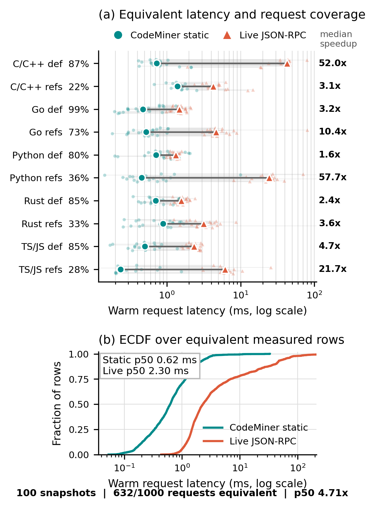

<!--
SPDX-FileCopyrightText: 2025-2026 CodeNib Contributors

SPDX-License-Identifier: Apache-2.0
-->

# LSP Core Acceleration Gate

## Dynamic Provider Acceleration

The agent-facing LSP contract should stay stable while the backend can switch
from live JSON-RPC to CodeNib's static graph index when the static index can
serve the same request shape.

Current implementation:

- `codenib.agent.lsp_provider.StaticLSPProvider` serves
  `textDocument/definition`, `textDocument/references`, and
  `codenib/lspRoute` over the loaded `symbol_graph`.
- Agent `lsp_definition`, `lsp_references`, and `lsp_route` skills use that
  provider, so dynamic tool calls get the same list-shaped results plus
  trace-only provider metadata.
- Native definition/reference skills expose only the common JSON-RPC contract:
  `file_path`, `line`, and `character`. Symbol-only lookup is a
  CodeNib extension and stays behind `lsp_route` rather than silently giving
  the static arm a stronger tool.
- Native `definition` and `references` results are normalized to a stable,
  provider-independent location DTO. Rich symbol nodes remain available through
  the CodeNib-only `route` capability.
- MCP `lsp_*` tools use the same provider and keep their serialized output
  format unchanged.
- Runtime traces record `lsp_provider`, `lsp_result_fingerprint`, and a compact
  result preview. Route traces also preserve the existing `route_args` and
  `route_fingerprint` fields.
- `codenib.eval.agent_runner.LiveLSPReferenceProvider` wraps the existing
  JSON-RPC `LSPClient` as a reference provider for validation. It normalizes LSP
  `Location` / `LocationLink` results into compact `QueriedNode` rows so the
  static and live paths can be compared by fingerprint.

This is the system-level acceleration path: if an agent asks for an LSP-like
operation, CodeNib can satisfy supported requests from the static index
without starting or round-tripping through a language server. It is separate
from startup preload and compact-context experiments.

The behavior guardrail is **agent-visible equivalence**, not byte-for-byte
native LSP parity. For each supported native capability, both providers emit
the same sorted location DTO fields; provider identity and behavior contract
stay in trace metadata and are not shown to the model. The replay gate compares
locations for coverage. The forced-call protocol check additionally requires
the complete model-visible DTO payload hash to match before admitting a case;
the task-level agent ablation does not filter cases by equivalence.

Full native LSP behavior is intentionally a larger contract than this gate:
language servers can return token selection ranges instead of symbol scopes,
choose import aliases or re-export sites, account for unsaved buffers, and
depend on workspace/build configuration. CodeNib should not claim universal
JSON-RPC equivalence from a static snapshot. It should claim fast-path
equivalence only for the request classes whose fingerprints match under the
agent-visible output contract, and fall back explicitly otherwise.

For `definition`, replay preserves ordered start locations. For `references`,
it compares an unordered start-location set because JSON-RPC does not promise a
cross-provider ordering. The provider facade then sorts and deduplicates those
locations before serialization, so an equivalent request has an identical tool
payload in both arms.

Validation entry point:

```python
from codenib.eval.agent_runner import (
    LSPProviderRequest,
    compare_static_to_live_lsp_provider,
)

rows = compare_static_to_live_lsp_provider(
    [
        LSPProviderRequest(
            capability="textDocument/definition",
            arguments={"file_path": "caller.py", "line": 41, "character": 12},
            request_id="demo-definition",
        )
    ],
    graph=symbol_graph,
    project_root="/path/to/repo",
    language="python",
)
```

The request arguments are graph-facing: `line` is 0-based, matching the
executors after the agent boundary conversion. Symbol-only static lookups are
not valid live-LSP comparison requests because JSON-RPC definition/references
operate on file positions.

For repeatable feedback loops, prefer the package CLI over ad hoc scripts:

```bash
cat > /tmp/lsp-provider-requests.jsonl <<'EOF'
{"request_id":"demo-definition","capability":"textDocument/definition","arguments":{"file_path":"caller.py","line":41,"character":12}}
EOF

codenib-lsp-provider-validate \
  --graph /path/to/graph.pkl \
  --project-root /path/to/repo \
  --language python \
  --requests /tmp/lsp-provider-requests.jsonl \
  --fingerprint-mode auto \
  --output-json /tmp/lsp-provider-report.json \
  --output-markdown /tmp/lsp-provider-report.md \
  --require-promotion
```

Use `--prebuilt-root ... --instance-id ...` instead of `--graph` when running
against agent-runner prebuilt artifacts. The default exit code fails on
mismatches and provider errors. `--require-promotion` additionally fails unless
every row is `equivalent_static_faster`; `--fail-on-fallback` makes unsupported
or unavailable static rows fail instead of recording them as explicit fallback
cases.

The default `--fingerprint-mode auto` uses ordered start-location fingerprints
for `textDocument/definition` and unordered start-location sets for
`textDocument/references`. Live LSP servers may return references in a
different order than CodeNib's graph traversal, so ordered fingerprints can
turn a valid location-set match into a false mismatch. Use
`--fingerprint-mode ordered-start` only when provider order is part of the
contract being tested.

The CLI validates native JSON-RPC LSP only. It rejects `codenib/lspRoute`
before starting a language server because route is a CodeNib extension, not a
native LSP request.

The live path requires an installed language server or an override such as
`CODENIB_PYTHON_LSP_CMD`. If no server command is available, use the fake
client unit path only; do not claim live equivalence from it.

Provider replay benchmark:

```bash
codenib-lsp-replay-benchmark \
  --graph /path/to/graph.pkl \
  --project-root /path/to/repo \
  --language cpp \
  --compile-db /path/to/repo/compile_commands.json \
  --baseline-graph /path/to/previous/graph.pkl \
  --command 'clangd --background-index --compile-commands-dir=/path/to/profile' \
  --max-per-capability 50 \
  --warmup-reps 1 \
  --warmup-until-stable \
  --minimum-equivalent-count 2 \
  --measured-reps 5 \
  --wait-until-idle \
  --idle-grace 10 \
  --output-json /tmp/lsp-replay-report.json \
  --output-markdown /tmp/lsp-replay-report.md \
  --require-all-equivalent
```

Use `--prebuilt-root ... --instance-id ...` for prebuilt agent-runner
artifacts. If `--requests` is omitted, the benchmark deterministically spreads
real file-position requests across graph `reference` edges: it reads each
`anchor_file` / `anchor_line`, places the cursor on the referenced target token,
and emits both `textDocument/definition` and `textDocument/references` requests
up to `--max-per-capability`. A JSON/JSONL `--requests` file can be used when
the same request set must be replayed across commits or machines.

Before starting the live language server, replay now applies the same artifact
quality gate as the clangd indexing pipeline. For C/C++, it reports compilation
database entries, resolved source paths, repository translation-unit coverage,
available range/unified metadata, and graph vertex/edge ratios when
`--baseline-graph` is supplied. The defaults require at least one compile
command, 1% repository source coverage, 50% graph-to-compile-DB translation-unit
coverage, and at least 50% of the baseline graph's vertices and edges.
`--allow-low-quality-artifact` exists for diagnosis only;
results from that mode are not valid acceleration evidence.

Some older prebuilt corpora ship legacy `graph.pkl` bundles with no schema
version and stale `project_root` values from the machine that built them. Audit
and normalize them before large replay runs:

```bash
codenib-prebuilt-normalize-graphs ${CODENIB_PREBUILT_DIR} --limit 20
codenib-prebuilt-normalize-graphs ${CODENIB_PREBUILT_DIR} \
  --write \
  --backup-suffix .legacy \
  --output-json /tmp/prebuilt-graph-normalize.json
```

Normalization rewrites only the graph pickle: it loads current or legacy graph
artifacts, rebinds `project_root` to `<prebuilt>/<instance>/repo`, rebuilds
missing range/unified indexes, and saves the graph with the current
`CodeGraph.save_graph` schema. It does not re-run SCIP/LSP indexing or rebuild
vector indexes.

The C/C++ indexing path writes `index_quality.json` next to `graph.pkl` and
returns failure when the report does not pass. A failed canonical artifact is
quarantined as `graph.rejected.pkl` so consumers cannot load it as a successful
index. Bear candidates are compared by
entry count instead of accepting the first non-empty JSON file. Build exit
status is not treated as compile-command coverage: Bear may capture useful
translation units even when a later compile or link step fails. When a Makefile
offers conventional extra-warning variables, the indexing-only build appends
`-Wno-error`; the selected clangd-facing compilation database also rewrites
`-Werror` and `-Werror=<warning>` in a derived copy, leaving the repository's
build configuration unchanged.

Calibration on the 19 C/C++ instances in the 100-instance `codenib-base`
sample produced graphs for 19/19 and passed the quality gate for 18/19 before
the fix. The rejected `micropython__micropython-10095` artifact had only 2
compile commands, 1,075 vertices, and 1,484 edges, versus 8,542 vertices and
68,792 edges in its baseline. Capturing `ports/unix` with non-fatal warnings
recovered 286 compile commands and produced 9,151 vertices and 72,207 edges.
Re-auditing all 19 regenerated artifacts with the default gate, substituting the
fixed micropython graph, passed 19/19. The minimum source coverage was 3.98%,
the minimum graph-to-compile-DB coverage was 66.1%, the minimum baseline vertex
ratio was 0.960, and the minimum baseline edge ratio was 0.946, leaving margin
above the defaults. The original low-coverage micropython graph represents less
than 1% of the repaired compile DB's translation units, so it is rejected even
when no baseline graph is supplied.
Across the run, clangd generation and graph decode were generally seconds to
tens of seconds; checkout, submodules, CMake, Bear, and Make dominated wall
time.

Replay is the preferred latency feedback loop for this gate because every row
uses the same graph-facing request against both providers. Warmup repetitions
are discarded; measured repetitions are aggregated by capability and overall.
The markdown report shows `p50` / `p95` / `p99` static and live latency,
median speedup, and median milliseconds saved. Setup costs are reported
separately as graph load, static provider init, and live LSP start time. Latency
distributions include only equivalent rows; mismatches and provider errors are
guardrail failures, not speedup data.

For paper runs, use `--warmup-until-stable` with a small non-zero
`--minimum-equivalent-count`. Process initialization and even consecutive stable
responses can precede full workspace analysis; the non-empty equivalence floor
prevents a stable-but-unusable live state from entering the measured region. The
default is zero so coverage studies can still measure snapshots with no
equivalent rows.

Forced-call provider protocol check:

```bash
codenib-lsp-provider-protocol-check \
  --graph /path/to/graph.pkl \
  --project-root /path/to/repo \
  --language go \
  --requests /path/to/fixed-requests.json \
  --command 'gopls serve' \
  --capability definition \
  --max-cases 2 \
  --reps 1 \
  --model vertex_ai/claude-haiku-4-5 \
  --output-json /tmp/lsp-agent-ab.json
```

This crossover holds the model, prompt, tool name/schema, and model-visible
result constant; it changes only the injected provider. Prompt caching is off
by default to avoid an arm-order confound. Use this only as an integration
guard for arguments, traces, turns, tokens, and answers: the harness supplies
the request and forces one tool call. The CodeNib Base agent ablation lets the
model adopt tools dynamically and exports live-arm calls for frozen replay.
Remote model wall time is not the LSP latency metric because API variance is
orders of magnitude larger than one warm semantic request.

The pinned Base sampling frame is now artifact-ready: 60/60 Go, Rust, and
TypeScript snapshots pass strict source/profile/graph/occurrence-index identity
checks under `${CODENIB_RESULTS_DIR}/lsp_agent_base_artifacts_v4`. The
artifacts contain 10,287,017 exact SCIP occurrences. This readiness result does
not replace request replay or constitute an agent outcome; it only removes
artifact drift from the dynamic adoption study.

The completed Haiku Base campaign yielded four naturally adopted live-arm
requests across Gin, Terraform, and Axios. Frozen five-repetition replay against
the same snapshot and request arguments produced 4/4 equivalent requests and
20/20 equivalent measured rows: two definitions and two references, with no
mismatch, error, or fallback. Static p50/p95 was 0.19/0.58 ms, live JSON-RPC
p50/p95 was 2.22/12.65 ms, and paired speedup p50 was 11.43x. Graph load, live
process start, and behavioral warmup p50 were 2.80 ms, 85.15 ms, and 1.78 s,
respectively, and remain separate setup metrics. The aggregate report is
`${CODENIB_RESULTS_DIR}/lsp_agent_base_haiku_v2_replay/aggregate.json`.

This natural trace is strong mechanism evidence but a small compatibility
sample. Generated cross-language requests still expose lower equivalence for
Rust and TypeScript references, so the system must preserve profile-specific
promotion and live fallback rather than globally replacing every JSON-RPC LSP
request.

### CodeNib Base 100-Snapshot Replay

The full CodeNib Base replay uses all 100 unique `(repo, base_commit,
language)` snapshots: 21 Go, 20 Rust, 19 TypeScript/JavaScript, 20 Python, and
20 C/C++. The frozen manifest is
`${CODENIB_RESULTS_DIR}/lsp_agent_base_study_manifest_v3.json` with SHA-256
`4a2376ad11e1ff4b54857c8f33e8b83c025e3a9fe7cb0da69cbd778e5078f6d4`.
All 100 snapshot/profile identities and artifact quality gates pass.

Each snapshot contributes five deterministic definition positions and five
reference positions. Both providers receive the same request. The live server
is allowed two warmup repetitions and additional repetitions until behavior is
stable; each measured request then runs ten times. C/C++ starts clangd with
`--background-index` and the exact profile directory as
`--compile-commands-dir`, and requires ten continuous idle seconds before the
timed region. Other languages require one idle second. Reports retain every
mismatch, while latency distributions include only requests whose result
fingerprints match in all repetitions.

| language | snapshots | definition equivalent | references equivalent | overall equivalent | equivalent-row p50 speedup |
| --- | ---: | ---: | ---: | ---: | ---: |
| C/C++ | 20 | 87/100 (87%) | 22/100 (22%) | 109/200 (55%) | 43.93x |
| Go | 21 | 104/105 (99%) | 77/105 (73%) | 181/210 (86%) | 6.03x |
| Python | 20 | 80/100 (80%) | 36/100 (36%) | 116/200 (58%) | 2.74x |
| Rust | 20 | 85/100 (85%) | 33/100 (33%) | 118/200 (59%) | 2.70x |
| TypeScript/JavaScript | 19 | 81/95 (85%) | 27/95 (28%) | 108/190 (57%) | 6.42x |

Overall, 632/1,000 requests (63.2%) are behaviorally equivalent: 437/500
definitions (87.4%) and 195/500 references (39.0%). Across the 6,320 admitted
measured rows, static p50 is 0.62 ms, live JSON-RPC p50 is 2.30 ms, and paired
speedup p50 is 4.71x. There are no measured provider errors or fallbacks. Two
transient reference errors occurred during 2,140 warmup rows; both affected
servers subsequently stabilized and had error-free measured regions.

The result supports a guarded fast path, not universal replacement. Definition
coverage is high across all languages, while reference coverage remains
backend- and language-dependent. Unsupported fingerprints must continue to
fall back to live JSON-RPC.

Reviewable aggregate artifacts committed with this experiment are:

- [aggregate Markdown](artifacts/lsp_replay_base_v3_100/aggregate.md)
- [single-column figure](artifacts/lsp_replay_base_v3_100/lsp_replay_100_single_column.png)



The full local report set, including all 100 per-snapshot reports and the PDF
figure, remains at:

- `${CODENIB_RESULTS_DIR}/lsp_replay_base_v3_100/aggregate.json`
- `${CODENIB_RESULTS_DIR}/lsp_replay_base_v3_100/aggregate.md`
- `${CODENIB_RESULTS_DIR}/lsp_replay_base_v3_100/lsp_replay_100_single_column.pdf`

Regenerate the figure from the 100 machine-readable reports with:

```bash
python scripts/profiling/plot_lsp_replay_paper.py \
  --reports-dir ${CODENIB_RESULTS_DIR}/lsp_replay_base_v3_100/reports \
  --output-prefix /tmp/lsp_replay_100_single_column
```

The separate two-snapshot Haiku extension pilot completed six cells without
runtime errors, but the model made zero native LSP calls in every arm and used
all 20 turns. Running the remaining 354 model cells would therefore measure
agent search variance and cost without adding LSP latency observations. The
100-snapshot provider replay is the primary acceleration experiment; dynamic
adoption remains a separate negative result.

Latest local pilot, using a two-file temporary Python repo and
`npx --yes --package pyright pyright-langserver --stdio`:

| request | same start location | static ms | live JSON-RPC ms | saved ms | verdict |
| --- | --- | ---: | ---: | ---: | --- |
| `textDocument/definition` from `caller.py:4` to `callee.py:1` | yes | 0.30 | 83.17 | 82.87 | `equivalent_static_faster` |
| `textDocument/references` with ordered start fingerprint | no | 0.49 | 3.11 | 2.63 | `mismatch` |
| `textDocument/references` with `start-set` fingerprint | yes | 0.59 | 3.65 | 3.07 | `equivalent_static_faster` |
| `textDocument/definition` on the same line but wrong character | n/a | 0.48 | 1.64 | 1.15 | `static_error` |

The pilot exposed three experiment-design constraints:

- Do not include `codenib/lspRoute` in static-vs-live JSON-RPC equivalence
  gates. It is a CodeNib extension, not a native LSP request.
- References should usually be gated by unordered start-location set equality;
  otherwise provider ordering differences dominate the result.
- Symbol-graph edges alone are not sufficient for native position queries.
  They discard local symbols and exact character ranges, so naturally adopted
  receiver/local-variable calls can fail even when the live server succeeds.
  Native position calls now use a separately versioned SCIP occurrence index
  and fall back to the graph only for a declaration omitted by an older SCIP
  producer. The graph remains the backend for symbol-oriented `lsp_route`.
- Exact positions improve coverage but do not imply universal behavioral
  equivalence. Indexer/server versions and workspace views can still differ,
  especially for Rust and TypeScript references. Compatibility is reported on
  every request; latency is aggregated only for matching fingerprints.

Each row reports static/reference provider status, result count, fingerprint,
latency, `latency_saved_ms`, `speedup_ratio`, and one of:

- `equivalent_static_faster`
- `equivalent_static_not_faster`
- `mismatch`
- `fallback_required`
- `static_error`
- `reference_error`

Promotion rule for dynamic LSP acceleration:

- static provider status is `ok`;
- reference provider status is `ok`;
- start-location fingerprints match for the request class being accelerated;
- static latency is lower on the same request shape;
- fallback reason is explicit when the graph or capability is unavailable.

Only after that gate should the harness route that request class to the static
provider by default.

This promotion is independent of whether preloaded route context improves the
final agent trajectory. Preload/compact experiments answer a policy question:
what evidence should be shown before turn 1? This gate answers the provider
question: when the agent or MCP client asks for LSP-shaped evidence, can the
static graph serve the same agent-visible behavior faster than JSON-RPC?

## Cold-start Graph Acceleration

Generic LSP graph support has two separable costs:

- language-server work: `documentSymbol` and optional `references` JSON-RPC calls;
- local decode work: converting the saved LSP payload into `CodeGraph` vertices,
  containment edges, range indexes, and optional reference edges.

Do not add a C++ LSP decoder until local decode is a measured bottleneck. The
current `core/` backend accelerates SCIP text decoding; it does not reduce
language-server latency.

Current C++ acceleration for layered graph work is intentionally narrower:
`codenib_core.classify_edge_layers(...)` classifies default graph layers for
the Python `MultiGraphIndex` when the pybind extension is present. This is a
query/index helper, not a generic LSP graph decoder. The implementation lives
in `core/graph_layers.{h,cpp}` so it is a real core API rather than binding
glue embedded in `bindings/pybind_module.cpp`.

Profile the shared graph-layer helper separately:

```bash
PYTHONPATH=build/core:$PYTHONPATH \
python scripts/profiling/profile_graph_layers.py --edges 1000000 --reps 3
```

Latest graph-layer sample:

```json
{
  "core_seconds_min": 0.1028488609008491,
  "edges": 1000000,
  "parity": true,
  "python_seconds_min": 0.3491414119489491,
  "speedup_vs_python": 3.3947037321641997
}
```

Use the synthetic decoder profiler to isolate local decode cost:

```bash
python scripts/profiling/profile_lsp_graph_decode.py \
  --files 1000 \
  --methods-per-file 20 \
  --include-references
```

Latest local sample:

```json
{
  "decode_seconds": 1.0546489779371768,
  "edges": 23004,
  "files": 1000,
  "vertices": 22005
}
```

That keeps the next acceleration target on LSP server lifecycle, batching, and
reference-query policy unless real repos show local decode/build time crossing
the promotion threshold below.

Promotion rule for a C++ LSP decoder:

- backend alignment is green for the target language;
- local decode/build time is at least 20% of end-to-end cold-start graph time;
- the C++ path has parity tests against the Python generic decoder for symbols,
  containment edges, reference anchors, and range indexes.

Until those conditions hold, optimize LSP server lifecycle, batching, and
reference-query policy first.
